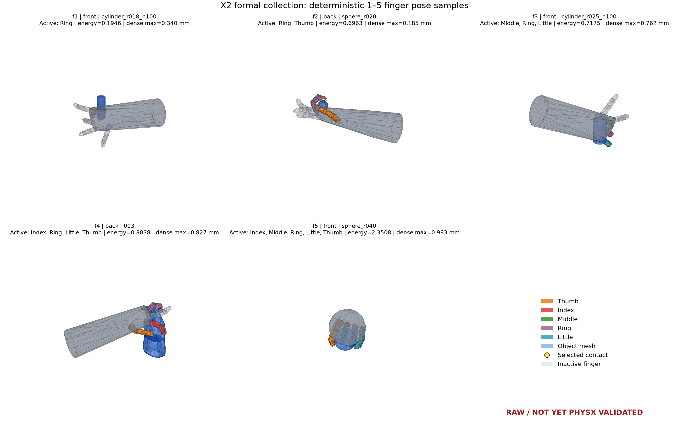
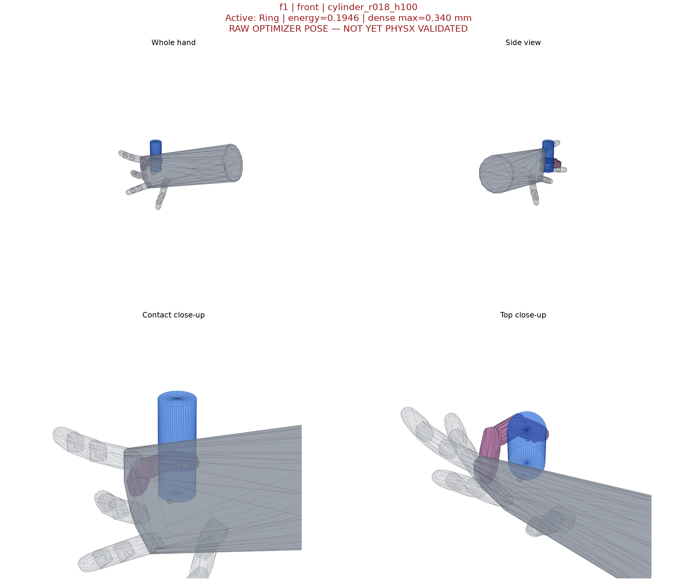
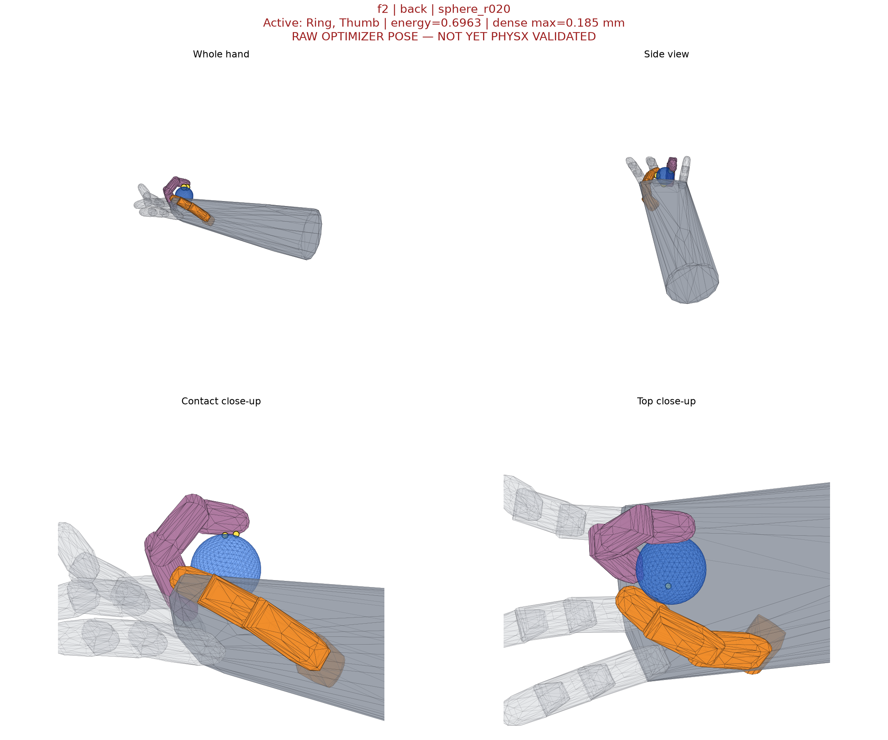
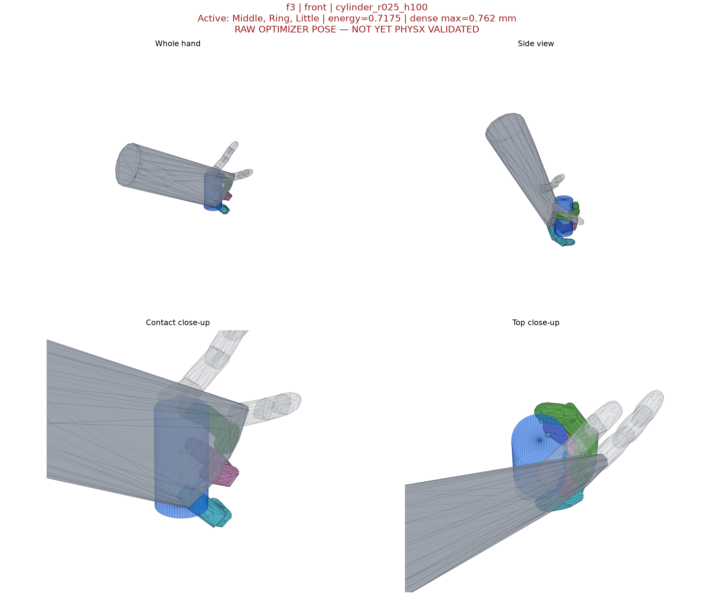
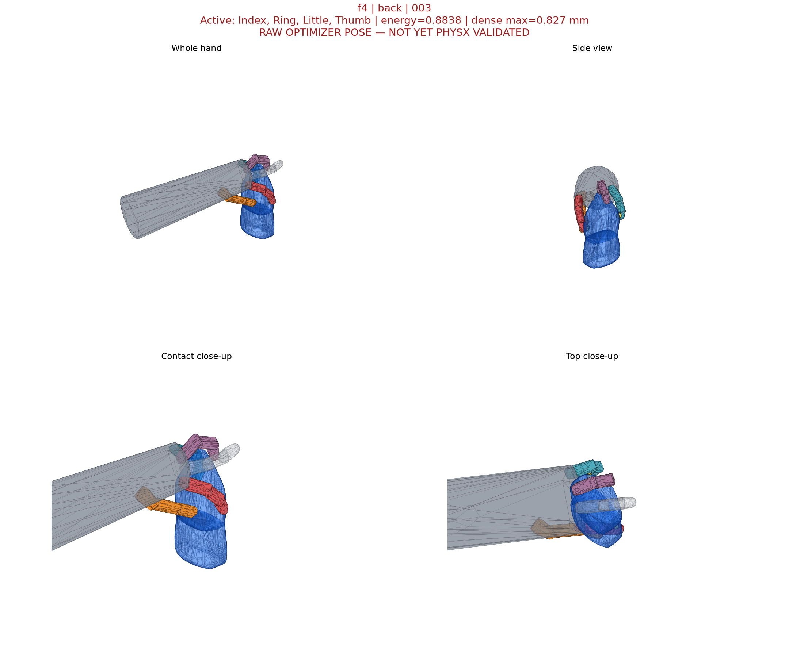
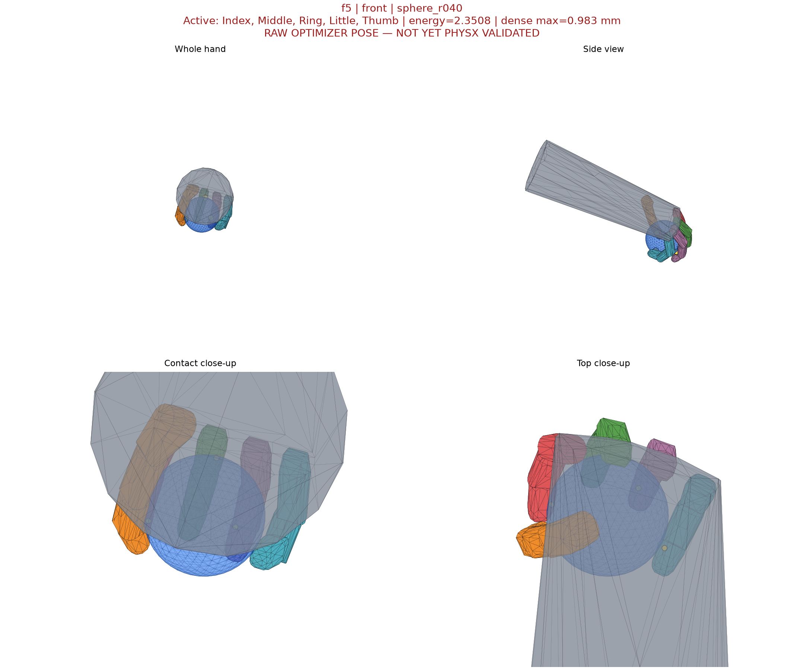

# X2 抓取数据采集实验日志

最后更新：2026-07-16 22:50 CST

## 技术摘要

- 正式目标已经锁定为 **5000 条 Isaac Sim/PhysX valid**，不是 5000 条 raw：front/back
  各 2500 条，每侧 f1、f2、f3、f4、f5 各 500 条。
- 官方通用 mesh inventory 为 88 个；正式数据确定性使用其中 30 个
  `000,003,...,087`，并保留 12 个 primitive，共 42 个正式物体。
- 当前生成协议为 `x2_mesh_grasp_unselected_finger_side_v6`，验证协议为
  `x2_object_centered_dexgraspnet_six_orientation_v7`，采集协议为
  `x2_balanced_complementary_30mesh_5000_v6`。
- 截至本次快照，正式目录中仍为 **0/5000 valid**；`attempt_0000` 已原子发布 1800 条 raw，尚未
  进入 PhysX v7。042 通用物体的跨 side、f1--f5 pilot 已完成：
  20/20 v6 raw 通过静态门，PhysX v7 得到 2/20 valid；正式 collector 的 `attempt_0000` 已于
  2026-07-16 17:06 CST 启动。attempt 完成证明写出前，pilot、历史样本、演示样本和运行中的
  raw 都不能计入正式配额。
- 当前最重要的负结果是：静态 dense/self-collision gate 全部通过并不保证动态 valid。
  041/back/f3 的 4 条 top-16 候选为 4/4 静态通过，但 PhysX 为 0/4 valid。因此正式启动前
  必须保留六方向 PhysX 闭环，不能用能量或静态穿透代替。

## 正式口径与完成证据

| 项目 | 正式定义 |
|---|---|
| 最终数量 | 恰好 5000 条 `validation.status=passed` |
| 双侧配额 | front 2500、back 2500 |
| 手指数配额 | 每侧 f1--f5 各 500；palm 不计入手指数 |
| 配对 | front f1↔back f4、f2↔b3、f3↔b2、f4↔b1；同物体且手指集合不相交 |
| f5 | front/back 各 500 条单侧记录，`pair_id=null` |
| 通用物体 | 从已审计 88 个中固定选择 30 个：`000,003,...,087` |
| 其他物体 | 12 个 primitive；最终正式 catalog 共 42 个物体 |
| 生成门 | v6、finite、关节限位、自碰撞 `<=0.5 mm`、dense 双向手物穿透严格 `<1 mm` |
| 动态门 | Isaac Sim/PhysX v7；六方向各 100 logical steps、2 substeps，六方向全部保持接触 |
| 完成文件 | `data/x2_valid_5000/manifest.json` 及其引用的 attempt `complete.json` 哈希 |

只有最终 manifest 同时证明数量、分层、配对、30-mesh 覆盖、v6/v7 协议及 attempt 哈希时，
才能把目标标记为完成。

## 当前受控参数

### 接触候选

- 候选文件：`data/contact_points/contact_points_x2_mesh.json`
- SHA-256：`25505d226f87ebce03f347dd3d4cd9353899f820847a77264c6a55aa7e242328`
- 总点数：287；front/back 各有 162 个 eligible 点。
- 区域：正反掌各 41、正反手指表面各 84、共享指尖 20、拇指 17。
- f1--f4 使用 4 个唯一 contact，f5 使用 5 个；指定手指集合时每根手指至少占一个 contact，
  其余槽只允许来自该集合或 palm。

### 生成器 v6

- 6000 次 simulated annealing；稀疏 checkpoint period=50，混合候选池 capacity=16。
- 候选池同时保留低能量与低穿透状态；最终 dense 审计全部 retained candidates，并在严格
  `<1 mm` 的状态中选择总能量最低者。
- dense hand surface 为 17 links × 768 点，共 13056 点；物体表面 8192 点。
- contact JSON、mesh、seed、迭代数、finger mask 和 pipeline revision 都写入或受 provenance
  审计。

### PhysX v7

| 参数 | 值 |
|---|---:|
| active drive stiffness | 1000 N·m/rad |
| active drive damping | 0.632455532 N·m·s/rad |
| active joint armature | 0.0001 kg·m² |
| solver | TGS (`solver_type=1`) |
| external force | 每个 TGS position iteration 施加 |
| articulation contact last | false |
| validation | 6 orientations × 100 logical steps × 2 substeps |
| mimic threshold | 0.01 rad |
| hand/object friction | 3.0 / 3.0 |

## 实验总表

| ID | 输入与分层 | 生成/验证 | 静态结果 | PhysX 结果 | 结论 | 正式可计数 |
|---|---|---|---|---|---|---|
| EXP-041-DRIVE-1E5 | mesh 041；front f2 4条 + back f3 4条 | v5 / 稳定性 A/B | dense 8/8，自碰撞 8/8 | 0/8 valid；2 个 non-finite orientation，1 个 non-finite sample | `1e-5 kg·m²` armature 仍不稳定 | 否 |
| EXP-041-DRIVE-1E4 | 同上 | v5 / v7 参数标定 | dense 8/8，自碰撞 8/8 | 1/8 valid；non-finite 0；最大 mimic `0.003061 rad` | 采用 `1e-4 kg·m²` 作为正式最小稳定 armature | 否，生成版本旧 |
| EXP-041-TOP16 | mesh 041；back f3；4条；seed 95001 | v5 top-16 / v7 | dense 4/4，自碰撞 4/4 | 0/4 valid；最大 mimic `0.001941 rad` | dense gate 不是动态持握替代品 | 否，生成版本旧 |
| EXP-SPHERE-V7-DEMO | sphere_r020；front；1条历史 raw | 历史生成 / 当前 v7 复核 | 静态门通过；旧 raw 不具备正式 v6 provenance | 1/1 valid；六方向通过；最大 mimic `0.003162 rad` | 证明当前 v7 重放链可得到真实 valid，仅用于窗口演示 | 否，生成版本旧 |
| EXP-042-V6-CROSS | 正式 mesh 042；front/back × f1--f5；每层2条 | v6 / v7 | dense 20/20，自碰撞 20/20，finite 20/20 | 2/20 valid；front f2、f3 各1条；120/120 orientation finite | 正式链路能产生真实 valid；主要瓶颈是动态丢失接触 | 否，pilot |
| EXP-COLLECT-A0000 | 12 primitive + 30 mesh；f1--f5 各1250 raw | v6 / v7 | 生成中 | 待生成完成后运行 | 首个正式 6250-raw attempt | 尚未；无 `complete.json` |

## 逐实验记录

### EXP-041-DRIVE-1E5 — armature 下界仍有非有限状态

**结果。** 8 条静态候选均满足 dense 手物门和自碰撞门，但 PhysX 为 0/8 valid；出现 2 个
non-finite orientation、1 个 non-finite sample。最大有限 mimic 误差为 `0.009935 rad`。

**解释。** 该结果只比较 runtime 数值稳定性，不能用于估计最终数据有效率。`1e-5 kg·m²`
不足以成为正式 active-joint armature。

**证据。** `/tmp/x2_official041_v5_arm1e5/physx_summary.json`

### EXP-041-DRIVE-1E4 — 正式 drive 稳定性标定

**结果。** 同一批 8 条候选得到 1/8 valid，48/48 orientation finite，最大 Newton mimic
误差 `0.003061 rad < 0.01 rad`。front 为 0/4，back 为 1/4。

**解释。** `1e-4 kg·m²` 是本轮观察到的最小全 finite armature，因此与 stiffness、damping、
TGS 参数一起锁入 PhysX v7。1/8 是特定小样本结果，不外推为全 catalog 有效率。

**证据。** `/tmp/x2_official041_v5_arm1e4/physx_summary.json`

### EXP-041-TOP16 — 静态全过但动态全失败

**结果。** 4/4 候选通过 dense `<1 mm` 和自碰撞门，且没有非有限状态；六方向 PhysX 最终
为 0/4 valid。失败样本主要在重力测试中丢失 hand-object contact，而不是 mimic 越限。

**解释。** top-16/all-dense 终选修复了“零穿透但明显分离”的 checkpoint 排序问题，却没有
把静态可行等同于动力学抓牢。collector 必须持续验证并补采，不能把这 4 条计入 valid。

**证据。**

- raw：`/tmp/x2_official041_v5_hybrid16_all_dense_back/back_single/raw/`
- summary：`/tmp/x2_official041_v5_hybrid16_all_dense_back/physx_v7_summary.json`

### EXP-SPHERE-V7-DEMO — Isaac Sim 窗口中的样本确实通过

**结果。** 当前 v7 复核为 `valid_count=1`、`failed_count=0`，六方向全部 finite、保持接触，
最大 mimic 误差 `0.003162 rad`。交互窗口显示的是该样本 identity 方向的最终冻结状态。

**限制。** 原始候选来自旧生成版本，所以即使当前 PhysX 通过，也不能进入正式 5000 条。

**证据。**

- raw：`/tmp/x2_sphere_valid_line_v6_n0/front_single/raw/sphere_r020_front_000031.json`
- v7 summary：`/tmp/x2_sphere_valid_line_v7_formal_summary.json`

### EXP-042-V6-CROSS — 正式子集跨手指数 pilot

**设计。** 对正式 30-mesh 子集中的 042 物体生成 front/back × f1--f5，每层 2 条，共 20 条；
使用 object scale 1.0、6000 iterations、batch 64、seed 96043 和 v6 contact provenance。

**静态结果。** 20/20 pipeline revision 为 v6，20/20 finite，contact-candidate SHA 匹配，
finger target/actual 一致；front/back × f1--f5 每层恰好 2 条。dense 双向门和自碰撞门均为
20/20 通过，最大 dense penetration 为 `0.979259 mm < 1 mm`，最大 self penetration 为 0。

**PhysX 结果。** v7 严格路由得到 2/20 valid、18/20 failed；front 为 2/10，back 为 0/10。
120/120 orientation finite，non-finite 和 mimic violation 均为 0，最大 Newton mimic error 为
`0.00795782 rad < 0.01 rad`。两个 valid 分别是 front f2 的第 0 条和 front f3 的第 1 条。

| side | f1 | f2 | f3 | f4 | f5 | 合计 |
|---|---:|---:|---:|---:|---:|---:|
| front valid / total | 0/2 | 1/2 | 1/2 | 0/2 | 0/2 | 2/10 |
| back valid / total | 0/2 | 0/2 | 0/2 | 0/2 | 0/2 | 0/10 |

80 个失败 orientation 全部没有末态 hand-object contact；所有记录的 failure reason 都是对应
方向的 `lost_contact`。因此本轮失败主因是动态持握能力，不是 non-finite、mimic 越限、finger
mask、dense gate 或自碰撞门。样本量只有每层 2 条，不能把 10% 总有效率外推到正式 catalog，
但已经满足“正式 v6 raw 可被 v7 路由并至少产生一条真实 valid”的 collector 放行条件。

**证据。**

- plan：`/tmp/x2_official042_v6_cross_strata_plan.json`
- output：`/tmp/x2_official042_v6_cross_strata/`
- v7 summary：`/tmp/x2_official042_v6_cross_strata/physx_v7_summary.json`
  （SHA-256 `c7e61cd904cc303211a28bbde259beb3ab35e574d625e240211c60a5b697b215`）
- valid front f2：`front_f2/front_single/valid/decomposed_front_000000.json`
  （SHA-256 `14b172aea075d21b26105dad7b67b37aae8ef8c5b4a9f53c7db6996e5e6ab40f`）
- valid front f3：`front_f3/front_single/valid/decomposed_front_000001.json`
  （SHA-256 `7fa42dde930909a60a240f3b8347cbd4f73f47111893c17d3b4751d296b9f320`）

### EXP-COLLECT-A0000 — 首个正式采集 attempt

**启动状态。** 2026-07-16 17:06 CST 启动，collector 锁已持有，两个 CUDA 生成 worker 正常运行。
当前正式计数仍为 0，因为该 attempt 尚未完成生成、v7 路由与 completion proof 审计。

**18:08 首批恢复点。** `sphere_r020`、`sphere_r030` 已各原子发布 150 条，共 300 raw；每个
物体的 front/back × f1--f5 均为每格 15 条，不是五指单一数据。逐 JSON 复核了 v6 revision、
6000 iterations、finger count、active side、finite、dense `<1 mm`、self-collision、raw 状态和
object scale，300/300 通过、0 error。按同物体/同 index 复核 front f1↔back f4、f2↔b3、
f3↔b2、f4↔b1，共 120 个互补 pair，finger set 交集全部为空。当前下一批为
`sphere_r040`、`cylinder_r018_h100`。

| 已发布对象 | front f1 | f2 | f3 | f4 | f5 | back f1 | f2 | f3 | f4 | f5 | 合计 |
|---|---:|---:|---:|---:|---:|---:|---:|---:|---:|---:|---:|
| sphere_r020 | 15 | 15 | 15 | 15 | 15 | 15 | 15 | 15 | 15 | 15 | 150 |
| sphere_r030 | 15 | 15 | 15 | 15 | 15 | 15 | 15 | 15 | 15 | 15 | 150 |

**18:24 catalog 独立复核。** `attempt_0000` 的 schema 4 metadata 实际固化了 12 个 primitive
和 30 个互不重复的通用 mesh：`000,003,...,087`。逐文件重新计算 SHA-256 并检查 scale 后
42/42 全部匹配、0 error；上游 88-object selection manifest 仍为 `passed=true`，其 SHA-256 为
`e009bc2fb1ed93879deb6e067b8931c01e727fd17afeedbc4d21d317f035ae0e`。因此“30 个 mesh”已有
运行中 attempt 的文件级证据，不只是配置或文档声明；最终是否全部覆盖仍由 valid manifest 决定。

**22:50 primitive 阶段完成。** 12 个 primitive 已各发布 150 条，共 1800 raw；当前进入通用
mesh `000`、`003`。front/back × f1--f5 每格均为 180，说明当前池不是五指单一数据；文件名
连续且 12 个物体每个恰好 150 条。逐 JSON 静态复核结果如下：

| 指标 | 数量 | 解释 |
|---|---:|---|
| raw | 1800 | 不是正式 valid |
| finite | 1800 | 全部数值有限 |
| self-collision feasible | 1800 | 全部通过生成器自碰撞门 |
| dense hand-object `<1 mm` | 1775 | 可继续竞争 PhysX valid |
| dense infeasible | 25 | v7 会加入 `dense_hand_object_penetration_not_feasible`，不能进入 valid |
| 生成互补 pair | 720 | 同物体、同 index，front/back 手指集合不相交 |
| 双方 dense feasible pair | 696 | 仍须双方各自通过六方向 PhysX 才是正式 pair |

25 条 dense infeasible 是 raw 候选中的显式负例，不是 valid 污染：其 JSON 的 `feasible=false`
与测得最大穿透一致，validator 的最终 `overall_success` 强制要求该 gate 为 true。它们会计入
failed，并为自适应下一 attempt 的有效率估计提供真实分母。当前不修改文件、不放宽门槛。

**23:01 初次抽样、23:47 公开脱敏刷新。** 从当前 dense feasible raw 中按能量最低、对象不重复的确定性规则，
交替抽取 front/back 的 f1--f5 各一条；彩色 link 表示参与手指，浅灰 link 表示未参与手指，
黄色点表示 selected contact。5 条的 `validation.status` 均为 `not_run`，因此图片标题和 manifest
均显式标成 `RAW / NOT YET PHYSX VALIDATED`，不能计入正式 valid。总览为
`data/x2_valid_5000/sample_visualizations_20260716/grasp_samples_overview.png`，SHA-256
`00104f98ef977122e938a8e12d4b7cd784ee948221752ddf2340796a0f068871`；5 个 raw/image SHA、
对象、side 和参与手指见同目录 `manifest.json`。23:47 刷新时通用 mesh `000`、`003` 已各发布
150 raw，因此 f4/back 样本更新为通用物体 `003`。公开图片的 PNG metadata 只保留仓库相对 raw
路径，不包含本机用户目录；raw 本身仍不上传。此时正式目录为 2100 raw、0 valid、0 failed，
front/back × f1--f5 每格 210，下一批通用 mesh `006`、`009` 正在生成。

**23:55 公开代码镜像。** 建立 public 仓库
`https://github.com/pig27777/DexGraspNet-X2-Collection`，筛选后的 X2 生成、PhysX v7、collector、
supervisor、final audit、测试、文档和脱敏样图由 draft PR `#1` 发布。公开扫描排除了所有
raw/valid/failed、运行日志、缓存、checkpoint、88 个通用 mesh 和许可未确认的 X2 USD/几何资产；
也清除了源码、systemd 模板与 PNG metadata 中的本机绝对路径。提交前 Python compile 通过，
collector/supervisor/final-audit 的 15 项 unittest 全部通过，6 张图片的 SHA、解码和 metadata
复核通过。公开仓库是代码与日志镜像，不是正式数据集发布位置。

> **状态提醒：以下均为 raw optimizer pose，尚未经过 Isaac Sim / PhysX valid，不能计入正式数据集。**



<details>
<summary>展开查看 5 张单样本多视角图片</summary>

#### f1 / front / ring / cylinder_r018_h100



#### f2 / back / ring + thumb / sphere_r020



#### f3 / front / middle + ring + little / cylinder_r025_h100



#### f4 / back / index + ring + little + thumb / general mesh 003



#### f5 / front / all fingers / sphere_r040



</details>

**守护状态。** 已启用用户级 `x2-valid-collector-supervisor.service`。它只在 collector 内核锁
释放且最终 manifest 未完成时用相同参数恢复，并将状态写入
`data/x2_valid_5000/collector_supervisor.log`；对应 4 项独立测试通过。该守护不改变正式协议，
也不把 partial raw 计作 valid。

**最终审计预案。** 新增只读 `scripts/audit_x2_valid_dataset.py`，用于 manifest 出现后重新验证
5000 个 SHA-256/source hard link、每条 v6/v7 证据、全部 completion proofs、front/back × f1--f5
配额、2000 个互补 pair、1000 个 f5 记录和 30 个通用 mesh。collector 与最终审计相关测试
10/10 通过；对当前未完成目录执行时按预期以退出码 1 拒绝，并报告 manifest 缺失。该审计已
接入 supervisor：5 项守护测试通过，最终共 15/15；服务已在不影响 collector PID 的情况下热
重载。它只在审计报告绑定当前 manifest SHA-256 后发布 `final_audit.json` 并正常退出。

**计划。** 总 raw target 为 6250；f1、f2、f3、f4、f5 各 1250 条，生成器会在 front/back
间使用互补 finger mask，并轮询 12 个 primitive 和固定 30 个通用 mesh。全部候选使用 6000
iterations、64-row stratified batches 和 v6；生成完成后才运行 v7（batch 32、100 logical steps、
2 substeps）。

**预计时间。** 依据 EXP-042 小批实测和暂定 10% valid 率，完整 5000 条的当前宽区间为连续
运行约 8--14 天；乐观 5--7 天，低有效率分层可能使总时长达到 2--3 周。该估计不作为结果，
`attempt_0000` 完成后必须用 42 个物体的实际每层吞吐和有效率重算。

**证据。**

- attempt metadata：`data/x2_valid_5000/attempts/attempt_0000/attempt.json`
- 守护日志：`data/x2_valid_5000/collector_supervisor.log`
- 守护实现：`scripts/supervise_x2_valid_collection.py`
- 最终独立审计：`scripts/audit_x2_valid_dataset.py`
- 正式完成证明（尚未生成）：`data/x2_valid_5000/attempts/attempt_0000/complete.json`
- 最终 manifest（尚未生成）：`data/x2_valid_5000/manifest.json`

## 方法与审计边界

1. 生成器只产生 `success=false`、`validation.status=not_run` 的 raw candidate。
2. 静态 gate 检查有限值、关节限位、自碰撞和 sampled 双向手物穿透；它不是连续碰撞证书，
   也不能证明在重力下持握。
3. PhysX v7 对每条样本测试六个重力方向。只有六方向全部 finite、末态仍有 hand-object
   contact、mimic 未越限且静态 gate 通过，才路由到 `valid/`。
4. attempt 只有在 generation summary、validation summary 和原始路由数量全部一致后才生成
   `complete.json`。没有该证明的 attempt 不贡献正式计数。
5. 最终按物体轮询抽样并审计互补手指集合，避免按文件名截断造成后部物体缺失。

## 限制与不确定性

- 当前通用 mesh 的动态有效率证据量很小，且不同实验使用的生成版本、finger mask 和 seed
  不完全相同；不能把 1/8、0/4 当作正式总体有效率。
- 现有历史 sphere valid 证明验证链可工作，但不证明 v6 正式 raw 的有效率。
- static sampled hull gate 不是连续几何证明；最终结论仍以 PhysX v7 路由和 manifest 为准。
- 本日志暂不用趋势图：各实验协议和分母不同，合并画线会制造不可比较的趋势。正式 attempt
  开始后，再追加同协议下按 attempt、side、finger_count 的累计表或图。

## 下一步

1. 持续监控 `attempt_0000`；生成结束后核对 6250 条 raw 和全部分层，再运行并审计 PhysX v7。
2. 每个 completed attempt 后追加 raw/valid/failed、分层有效率、累计配对数和 30-mesh 覆盖。
3. 达到配额后复核最终 manifest、5000 个 SHA-256、2000 个双侧 pair、1000 个单侧 f5 条目
   以及全部 attempt completion proofs。

## 待回答问题

1. 在同一 v6/v7 协议下，f1、f2、f3、f4、f5 的实际 PhysX valid 率分别是多少，哪一层是
   500 条正式配额的吞吐瓶颈？
2. top-16 混合 checkpoint 池相对单一最低能量 checkpoint，是否在相同 mesh、seed 和 raw 数量下
   提高动态 valid 率？该问题需要同协议成对 A/B，不能用现有异构实验回答。
3. collector 运行后，30 个正式通用 mesh 是否都进入最终选择；若某些物体长期零 valid，是否需要
   调整 scale/contact 候选而不放宽 v7 验证标准？

## 后续实验追加模板

```markdown
### EXP-YYYYMMDD-NNN — 简短结论

**目的/假设。**

**代码契约。** pipeline revision、validation protocol、collection revision。

**输入。** mesh/object IDs、side、finger_count/mask、样本数、seed、scale。

**命令。** 可复现命令或 attempt metadata 路径。

**静态结果。** finite、energy、dense hand-object、自碰撞、finger mask。

**PhysX 结果。** valid/failed、六方向、mimic、主要失败原因。

**结论与限制。** 该结果证明什么、不证明什么、是否改变正式参数。

**正式资格。** 是否可计入 5000；若否，写明原因。

**证据。** raw、summary、manifest/complete.json、SHA-256。
```

## 相关文档

- [通用 mesh 生成器](x2_mesh_grasp_generator.md)
- [Primitive 与 30-mesh 正式数据协议](x2_primitive_dataset.md)
- [Isaac Sim / PhysX v7 验证](x2_physx_grasp_validation.md)
- [正式采集运行日志与断点恢复手册](x2_collection_runbook.md)
- [Codex 账号/会话交接说明](x2_codex_handoff.md)
