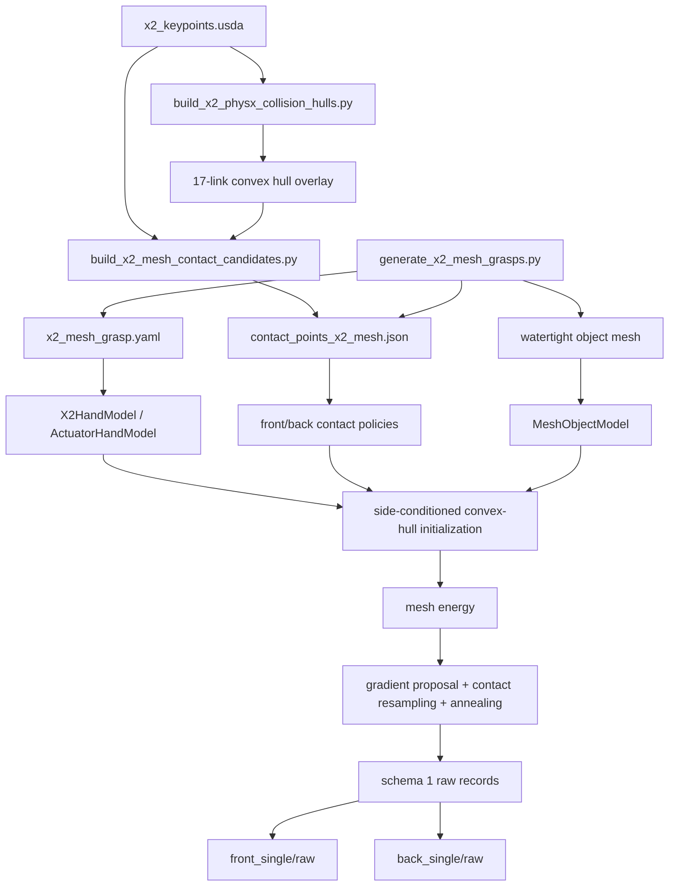

# X2 通用 Mesh 抓取生成器：当前总代码逻辑

本文档描述仓库当前唯一的 X2 抓取生成路径。内容以实际代码为准，不描述已经删除的实验
实现，也不修改官方 DexGraspNet 源码。

当前数据版本：

```text
pipeline_revision = x2_mesh_grasp_unselected_finger_side_v6
schema_version = 1
```

## 1. 当前目标与边界

输入一个 watertight triangle mesh，使用真实 X2 USD、同一套 12 actuator 和 12→16 FK，
生成 front 或 back 掌面条件下的单物体抓取候选。

当前实现包含：

- 任意 watertight mesh 的三角面距离查询；
- front/back 双掌面条件化初始化；
- translation、rotation-6D 和全部 12 actuator 联合优化；
- authored hand-surface contact candidate；
- DexGraspNet 风格的连续梯度 proposal、离散 contact resampling 和 simulated annealing；
- `E_fc`、`E_dis`、`E_pen`、capsule `E_spen`、hull `E_spen_hull`、`E_joints`、弱 `E_side`，以及未选手指
  对侧弯曲约束 `E_unselected_opposite_flex`；
- 逐样本可行 checkpoint、稀疏 top-K 候选池、独立 dense 双向穿透终审、严重自穿透
  proposal 保护和最终 checkpoint 恢复；
- schema 1 raw JSON 输出。

当前实现不包含：

- 同一姿态同时抓两个物体；
- 优化后的平移搜索/postprocess；
- 连续表面 penetration certificate（当前 hull 判据仍是确定性离散采样）；
- Isaac Sim/PhysX 抓取有效性验证；
- 自动写入 `valid` 或 `failed`；
- 千级 GPU batch 的性能承诺。

生成结果始终是未验证候选。仅凭能量下降或 sampled penetration 不能认定抓取成功。

官方 DexGraspNet 2.0 的 88 个通用 mesh 全部受 inventory manifest 审计；正式采集层固定组合
12 个 primitive 和其中确定性选出的 30 个通用 mesh（ID `000,003,...,087`）。manifest 必须
逐物体给出 `object_scale=1.0` 和 SHA-256。生成器负责产生 raw，
`collect_x2_valid_dataset.py` 才负责反复生成、Isaac Sim/PhysX 验证和最终配额审计。正式结果
严格为 5000 valid：front/back 各 2500，且每侧 f1..f5 各 500；这不会改变本单 mesh
生成器“输出均为未验证候选”的边界。

## 2. 官方 DexGraspNet 源码边界

官方目录中的原始 Python 源码保持不变，包括：

```text
grasp_generation/main.py
grasp_generation/scripts/
grasp_generation/tests/
grasp_generation/utils/energy.py
grasp_generation/utils/hand_model.py
grasp_generation/utils/hand_model_lite.py
grasp_generation/utils/initializations.py
grasp_generation/utils/object_model.py
grasp_generation/utils/optimizer.py
grasp_generation/utils/rot6d.py
```

X2 适配器使用原始 `rot6d.py` 的 rotation-6D 转换，但 X2 手模型、mesh query、contact
metadata 和 CLI 都在独立文件中实现。

## 3. 当前文件职责

| 文件 | 职责 |
|---|---|
| `configs/x2_mesh_grasp.yaml` | X2 关节、掌面、候选构建、初始化、能量和退火参数 |
| `scripts/build_x2_physx_collision_hulls.py` | 从 X2 几何重建每个刚体的低顶点凸碰撞 hull overlay |
| `scripts/build_x2_mesh_contact_candidates.py` | 直接从 USD marker 构建 287 点 contact JSON |
| `scripts/generate_x2_mesh_grasps.py` | CLI、side batch、依赖构造、输出路由和 summary |
| `scripts/generate_x2_mesh_grasps_stratified.py` | 同物体多 side/finger row-policy 常驻批处理 |
| `scripts/generate_x2_primitive_dataset.py` | 12 primitive + manifest 通用 mesh 的分层调度与 resume |
| `scripts/collect_x2_valid_dataset.py` | completed-attempt 闭环、PhysX 补采和严格 5000-valid 物化 |
| `scripts/diagnose_x2_self_collision.py` | 对单条 raw JSON 输出 capsule/hull 自碰撞逐 pair 审计 |
| `grasp_generation/utils/x2_config.py` | 严格加载和校验 X2 mesh YAML |
| `grasp_generation/utils/actuator_hand_model.py` | USD 校验、12→16 映射、FK、collision samples、自碰撞 proxy |
| `grasp_generation/utils/x2_hand_model.py` | 21-D batch pose、contact FK、世界坐标碰撞和 hand distance |
| `grasp_generation/utils/x2_mesh_contacts.py` | 候选 schema、side filter、唯一随机选点和逐槽重采样 |
| `grasp_generation/utils/mesh_object_model.py` | watertight mesh 加载、三角面 query 和物体表面采样 |
| `grasp_generation/x2_mesh_generator.py` | convex-hull 初始化、能量、退火优化和记录序列化 |
| `data/contact_points/contact_points_x2_mesh.json` | 运行时读取的持久化候选池 |
| `tests/test_x2_mesh_generator.py` | 双掌面、contact、能量、CLI 和 builder 回归测试 |

## 4. 总调用链



CLI 的实际入口顺序是：

1. `_parse_args()` 校验参数；
2. `run()` 设置 NumPy、PyTorch 和 CUDA seed；
3. 加载 YAML 和 contact JSON；
4. 分别构造 front/back `GenericDexterousContactPolicy`；
5. 构造一个共享的 `X2HandModel`；
6. `_requested_side_batches()` 生成 side-conditioned batch；
7. 每个 batch 构造一个 `MeshObjectModel`；
8. `optimize_x2_mesh_batch()` 初始化并优化；
9. `make_sample_records()` 生成结构化记录；
10. `_write_records()` 只写对应 side 的 `raw`；
11. `_summarize()` 输出终端统计。

## 5. Contact JSON 重建逻辑

运行：

```bash
conda run -n isaaclab --no-capture-output \
  python scripts/build_x2_mesh_contact_candidates.py
```

builder 不读取其他中间 contact JSON。四指、双掌面和 thumb 都直接来自
`x2_mujoco/x2_keypoints.usda`。

### 5.1 公共校验

- USD 必须使用米；
- marker 必须是无 physics API 的 Sphere；
- marker radius 必须为 `1.5 mm`；
- marker 根据最近的 `RigidBodyAPI` ancestor 归属到真实 link；
- marker center 从 USD world transform 转到 owning-link local frame；
- 候选点必须有限、法向必须为单位向量；
- point ID 全局唯一；
- 同一 link 上两点距离不得小于等于 `1e-7 m`。

### 5.2 四指候选

四根非拇指手指每根必须有 47 个 authored marker，共 188 个。marker center 投影到 owning
link 的凸碰撞 hull，最大允许投影距离为 `1 mm`，并要求离 revolute joint seam 至少
`8 mm`。

每个 distal link 按 local `+X` 坐标选择最外侧四分位作为 shared fingertip。因此四根手指
合计得到 20 个 shared fingertip，front/back 均可使用。

其余四指点使用零位 FK 后的 outward normal 和 front palm normal 分类。阈值为 `0.25`：

```text
dot >=  0.25  -> front_finger_surface
dot <= -0.25  -> back_finger_surface
其他          -> shared_fingertip
```

这个分类发生在 JSON 构建阶段，运行时不会根据世界坐标正负重新猜测 side。

### 5.3 双掌面候选

正掌 marker 是 authored original group；反掌 marker 必须通过
`keypoints:mirrorSource` 显式对应正掌 marker。每侧必须正好 41 个点。

镜像关系要求：

```text
back_xyz ≈ [front_x, -front_y, front_z]
```

每个掌面 marker 沿对应的 calibrated palm normal 投射到掌面碰撞 hull 的 load face：

```text
front normal = [0, +1, 0]
back normal  = [0, -1, 0]
```

投射距离上限为 `10 mm`，目标 hull face normal 与掌面 normal 的 dot 必须至少为
`0.8191520443`，投影后 41 点 centroid 必须匹配 YAML 中的 palm center。

### 5.4 Thumb 候选

USD 中必须正好存在 17 个 authored thumb Sphere：

| Thumb link | 数量 |
|---|---:|
| `rh_thbase` | 0 |
| `rh_thproximal` | 4 |
| `rh_thmiddle` | 4 |
| `rh_thdistal` | 9 |
| 合计 | 17 |

thumb marker 投影到 owning-link hull，最大投影距离为 `1.5 mm`。17 个点全部写为：

```json
"supported_sides": ["front", "back"]
```

thumb 的 local outward normal 仍参与能量，但不用于静态排除 front 或 back。

### 5.5 当前候选池

| Region | 数量 | front 可用 | back 可用 |
|---|---:|---:|---:|
| `front_palm` | 41 | 41 | 0 |
| `back_palm` | 41 | 0 | 41 |
| `front_finger_surface` | 84 | 84 | 0 |
| `back_finger_surface` | 84 | 0 | 84 |
| `shared_fingertip` | 20 | 20 | 20 |
| `thumb` | 17 | 17 | 17 |
| 总计 | 287 | 162 | 162 |

contact JSON 的内容哈希不在文档中硬编码。生成器读取文件时计算实际 SHA-256，并把它写入
每条 raw 的 provenance；重建或替换候选池后，审计应以该条记录中的哈希为准，避免文档值
与运行输入漂移。

## 6. Contact 运行时选取逻辑

每个 side 的 eligible pool 条件为：

```text
candidate.enabled
and active_side in candidate.supported_sides
and (allow_thumb or candidate.finger_name != "thumb")
```

当前 `allow_thumb=true`，默认 `n_contact=4`。未指定手指分层时，初始化执行：

```python
rng.choice(eligible_indices, size=n_contact, replace=False)
```

因此是“按点均匀”，不是“按 region 或 finger 均匀”：

- 4 个 point ID 必须唯一；
- 不要求包含 palm；
- 不要求包含 thumb；
- 不要求来自不同手指；
- 同一手指可以占多个 contact slot；
- region 点数越多，被抽中的总概率越大。

优化过程中，每个 slot 每一步以 `switch_possibility=0.5` 尝试重采样。新点从同 side 的
eligible pool 均匀抽取，同时排除其他 slot 已占用的点；原 slot 自己仍在可选集合中，因此
一次重采样尝试也可能保持原 point ID。

`active_side` 在初始化前确定，在该样本整个优化过程中不会从 front 切换到 back。

正式分层数据使用 `--finger-count K`，要求 selected contacts 中去除 palm 后正好包含 K 个
不同的 `finger_name`。K=1..4 时仍使用 4 个唯一 contact；K=5 时使用 5 个唯一 contact。
`--finger-names ...` 进一步固定精确手指集合。初始化先保证每个指定手指至少有一个 contact，
其余 slot 只能来自该手指集合或 palm；退火的逐 slot 重采样会枚举并过滤候选，因此不能漂移
出目标手指数或目标集合。每条 JSON 写入：

```json
"finger_participation": {
  "target_count": 2,
  "actual_count": 2,
  "finger_names": ["index", "thumb"]
}
```

批量入口的 `--complementary-side-fingers` 为同一物体生成互补集合：front f1 ↔ back f4、
front f2 ↔ back f3、front f3 ↔ back f2、front f4 ↔ back f1，两侧集合交集严格为空。
正式终选对每种映射各保留 500 个同物体 pair。f5 的集合包含全部五指，不存在非空的互斥
对侧集合，因此 front f5 和 back f5 各自保留 500 条单侧 valid，最终 manifest 中
`pair_id=null`。

## 7. Side 模式

| CLI | 实际行为 | 输出样本数 |
|---|---|---:|
| `--side front` | 所有样本固定 front | `num_grasps` |
| `--side back` | 所有样本固定 back | `num_grasps` |
| `--side both` | 独立运行 front 集合和 back 集合 | `2 * num_grasps` |
| `--side any` | 每个样本以相同概率随机选 front/back | `num_grasps` |

`both` 不是双物体，也不是一只手同时使用两个掌面。它只是生成两组独立的单物体样本。

`any` 的有限样本数量不保证严格各半，但相同 seed 可复现；实际 side 保存到每条记录的
`active_side`。

## 8. X2 手状态与 FK

每个 batch pose 是 21-D：

```text
global translation    3
global rotation-6D    6
X2 actuator          12
-----------------------
hand pose            21
```

rotation-6D 使用官方 DexGraspNet `rot6d.py` 转为 3×3 rotation matrix。

12 actuator 在 `ActuatorHandModel.expand_actuators()` 中展开为 16 joints：

```text
rh_LFJ1 = rh_LFJ2
rh_RFJ1 = rh_RFJ2
rh_MFJ1 = rh_MFJ2
rh_FFJ1 = rh_FFJ2
```

front/back 使用同一个 `ActuatorHandModel`、同一套 FK 和同一 pose tensor。不存在镜像手模型。

默认优化全部 12 actuator。只有 CLI 显式传入 `--freeze-thumb` 时，四个 thumb actuator 在
每次 materialization 中替换成 YAML 的固定值；非 thumb gradient 仍保留。

选中 contact 的 link-local point 和 normal 先通过所属 link FK 变到 hand root，再通过全局
rotation/translation 变到 world frame。每个 contact 使用自己的 authored/projected normal。

碰撞采样对 17 个 link 都保留 vertex、triangle centroid 和 area-weighted face-interior 三组
点。默认每组每 link 24 点，即每 link 72 点、整手 1224 个 sampled collision points。

## 9. MeshObjectModel

物体在 world origin 保持不动，优化的是手相对物体的 pose。

加载阶段：

1. 使用 trimesh 读取单个 triangle mesh；
2. 删除未引用 vertex 并修复 face normal；
3. 要求 mesh watertight；
4. 按 `object_scale` 缩放 vertex；单 mesh YAML 默认 `0.1`，正式 30-mesh 子集由完整
   88-object inventory manifest 覆盖为 `1.0`；
5. 拒绝退化 triangle；
6. 构造 object convex hull，仅用于初始化；
7. 按 triangle area 采样物体表面点，默认 256 点，用于 reverse penetration。

距离查询使用 PyTorch 的 point-to-triangle closest-point，不退化为 nearest vertex。查询按
triangle chunk 和 point chunk 执行，优化 tensor 不转换到 NumPy。

物体 signed distance 采用当前 DexGraspNet 兼容语义：

```text
inside  -> positive
surface -> zero
outside -> negative
```

sign 由 query point 相对最近 triangle outward normal 的方向决定。

## 10. Side-conditioned convex-hull 初始化

`initialize_x2_convex_hull()` 的步骤如下：

1. 复制 object convex hull；
2. vertex 沿径向外扩 `hull_inflation=0.20`；
3. 在 inflated hull 按面积随机采样 `100 * batch_size` 个点；
4. 用 deterministic farthest-point selection 取每个初始化的 surface seed；
5. seed 投影回原始 hull，得到朝物体内部的 approach base direction；
6. 在 `[-30°, +30°]` cone 内随机 jitter approach；
7. 绕 approach 随机 roll `[0, 2π)`；
8. 根据 active side 选择 `front_grasp_frame` 或 `back_grasp_frame`；
9. 将对应 palm center 放在 inflated surface seed 外侧随机 `0.20–0.30 m`；
10. 从 canonical open pose 对 12 actuator 加 truncated normal jitter；
11. 从当前 side 的 eligible pool 均匀无放回选择 contact IDs；
12. materialize 21-D pose、16 joints、contact world points 和 normals。

front 和 back 分别使用真实 grasp frame、真实 FK 和真实候选池，不通过 world-space 镜像生成。

## 11. 当前能量

总能量为：

```text
E_total = E_fc
        + 100 * E_dis
        + 100 * E_pen
        +  10 * E_spen_capsule
        + 100 * E_spen_hull
        +   1 * E_joints
        +   1 * E_side
        +   1 * E_unselected_opposite_flex
```

### 11.1 `E_dis`

对选中 contact 的 object signed distance 取绝对值并求和：

```text
E_dis = sum_i |sdf_object(contact_i)|
```

inside 和 outside 都被拉向真实 mesh surface。

### 11.2 `E_fc`

首先使用 object outward normal 和 contact world position 构造 DexGraspNet 风格 grasp
matrix，计算合 wrench 残差；然后加入每个 hand candidate outward normal 与 object outward
normal 的反向对齐项：

```text
normal_dot_i = dot(hand_outward_i, object_outward_i)

E_fc = ||normal_object * grasp_matrix||²
     + 5 * sum_i (normal_dot_i + 1)²
```

目标是 `normal_dot -> -1`。这里不会把所有 finger normal 替换成 palm normal。

### 11.3 `E_pen`

对预采样的 object surface points 查询其进入 17-link hand convex hull union 的正深度：

```text
E_pen = sum relu(hand_inside_depth(object_surface_samples))
```

这是 sampled reverse-direction penetration energy，不是连续证书。

### 11.4 capsule `E_spen` 与 sampled-hull `E_spen_hull`

兼容字段 `E_spen`（同时显式记录为 `E_spen_capsule`）仍是 98 个 capsule proxy pair 的
正重叠之和：

```text
E_spen_capsule = E_spen = sum relu(capsule_overlap)
```

capsule 只作为历史能量和 broadphase，不再作为自碰撞唯一依据。原 PCA capsule 的端点回缩
可能让真实 hull 顶点落在 proxy 外；broadphase 因此使用 capsule 半径加该 link 的最大 hull
拟合残差及 `1 mm` margin，保证不会据此漏掉 hull 候选。

sampled-hull 集包含 119 对：排除 16 个直接父子 link，并显式排除 canonical pose 中结构性
相交的 `rh_palm-rh_thproximal`。旧 capsule 专用排除 `rh_palm-rh_thmiddle` 不作用于 hull。
每个 link 分别取 64 个 vertex、64 个 face-centroid 和 64 个 face-interior 样本，逐 pair 计算
两个方向的 convex-plane signed depth。设正 `d` 表示样本位于另一个 convex hull 内：

```text
q(d) = smoothness * softplus((d + clearance_margin) / smoothness)
phi(d) = q(d) + q(d)^2 / clearance_margin

pair_loss = max(phi(A->B), phi(B->A))
          + 0.5 * (mean(phi(A->B)) + mean(phi(B->A)))

E_spen_hull = sum pair_weight * pair_loss
```

默认 `clearance_margin=0.5 mm`、`smoothness=0.1 mm`，thumb-index pair weight 为 2，其他为 1。
诊断值不用 clearance margin，而对原始 signed depth 取 `relu`：`maximum_penetration` 是所有
方向样本的最大值，`total_penetration` 是逐 pair 双向正深度之和。可行阈值为 `0.5 mm`。

### 11.5 `E_joints`

分别检查 12 actuator 和 materialized 16 joints，只有越界部分产生线性 penalty：

```text
E_joints = sum actuator_limit_violation + sum joint_limit_violation
```

优化器不会在每步之后 hard clamp actuator。

### 11.6 `E_side`

将 world origin 中的 object center 变换到 hand root，要求它至少位于 active palm outward
normal 一侧 `side_margin=5 mm`：

```text
projection = dot(object_center_root - palm_center[side], palm_normal[side])
E_side = relu(side_margin - projection)²
```

这是弱 side-conditioning prior，不代替 contact、force closure 或 penetration。

### 11.7 `E_unselected_opposite_flex`

该项只处理当前没有任何 selected contact 的手指。某根手指只要有一个候选点被选中，整根
手指就从该项中豁免；palm contact 不会把任何手指标记为已选。index、middle、ring、little
和 thumb 使用相同规则。

实现不根据 actuator 正负号猜方向。对每根手指取真实 distal link collision hull 的中心，
通过当前 X2 FK 得到 hand-root 位置，并与 canonical open pose 的同一点比较：

```text
delta_f = distal_center_current_f - distal_center_canonical_f

forbidden_normal(back grasp)  = front_palm_normal
forbidden_normal(front grasp) = back_palm_normal

wrong_displacement_f = relu(dot(delta_f, forbidden_normal) - margin)
E_unselected_opposite_flex =
    sum_unselected_fingers (wrong_displacement_f / displacement_scale)^2
```

当前 `margin=0`、`displacement_scale=0.02 m`、总能量权重为 `1`。因此未选手指沿错误掌面
方向移动 20 mm 时贡献 1 单位能量；沿 active side 弯曲不增加该项。back 抓取中未选手指
向 front 弯曲会受罚，front 抓取则完全对称。该项使用共享手根、同一组 actuator 和真实
FK，不复制手模型，也不修改 contact candidate JSON 的结构。

## 12. 优化器实际逻辑

`X2MeshAnnealing` 保存一个对 21-D pose 的 batch-shared squared-gradient moving average：

```text
ema_grad = mu * mean_batch(grad²) + (1 - mu) * ema_grad
mu = 0.98
```

第 `step` 步的连续 proposal：

```text
scale = 0.005 * 0.95 ^ floor(step / 50)
pose_proposal = pose - scale * grad / (sqrt(ema_grad) + 1e-6)
```

同一步内，每个 contact slot 以 0.5 概率尝试 side-filtered 重采样。连续 pose proposal 和本步
全部 contact changes 作为一个联合 proposal 评估。

temperature：

```text
T = 18.0 * 0.95 ^ floor(step / 30)
```

每个 batch sample 独立接受：

```text
p_accept = exp((E_old - E_new) / T)
accept if uniform(0,1) < p_accept
```

能量下降时实际必然接受；能量上升时仍可能按温度接受。若 proposal 将最大 hull 穿透推到
`1 mm` 以上且比当前状态增加超过 `0.1 mm`，则在 Metropolis 前逐样本拒绝；降低穿透的
proposal 不受该保护阻挡。非有限 proposal 在回滚前拦截。

初始状态和每个已评估 proposal（包括随后被拒绝的 proposal）都会更新逐样本自碰撞
checkpoint：

- feasible bank 保存 `maximum_penetration <= 0.5 mm` 中总能量最低的状态；
- 若从未可行，fallback bank 按最大穿透、总穿透、总能量、最早 step 的字典序保存。

此外，初始状态、每 50 步以及最终 live state 中通过自碰撞门的行，会进入容量为 16 的混合
checkpoint 池：一半按总能量排序，一半按稀疏双向 hand-object maximum、total、energy、最早
step 排序，并对相同 pose/contact 去重。优化结束后会 dense 审计池中全部候选，并额外审计尚未
入池的最低能量 self-feasible checkpoint；在所有严格小于 1 mm 的候选中选择总能量最低者，
再以 dense maximum、total 打破平局。只有一个 dense 候选都不通过时，才按 dense maximum、
total、energy 选择 fallback。
恢复后对最终整批再执行一次相同 dense 审计，最终 JSON 不复用稀疏结果。

pose/contact 是权威 checkpoint 表示；恢复时重新 materialize 12 actuator、16 joint、能量和
自碰撞诊断，而不是返回高温退火阶段最后接受的状态。

正式 CLI 默认 `n_iterations=6000`，与仓库原始
`grasp_generation/scripts/generate_grasps.py --n_iter` 一致。按当前 schedule，100 步结束时
温度仍约为 `15.43275`、step size 约为 `0.0045125`；6000 步结束时温度约为
`0.000631`、step size 约为 `1.06e-5`，才进入源码预期的充分退火量级。CLI 显式传入较小值
时仍会覆盖默认值。

## 13. 最终 penetration diagnostics

v6 最终硬门使用与优化采样独立的固定密度：17 个 link 各取 256 个顶点、256 个三角形
质心和 256 个确定性面内点（共 768/link、13056 hand points），物体取 8192 个确定性
surface points。计算两个 sampled maximum：

```text
forward = max relu(object_sdf(hand_collision_samples))
reverse = max relu(hand_inside_depth(object_surface_samples))
maximum_penetration = max(forward, reverse)
feasible = evaluated and finite and maximum_penetration < 0.001
```

等于 1 mm 不通过。物体查询使用空间 leaf AABB 作为可证明安全的 broadphase，但候选 leaf 内仍
执行完整 point-to-triangle 最近点计算，不用 nearest-vertex 或近似阈值替代。顶层
`maximum_penetration` 等于该 dense 双向 maximum。
link-link 自碰撞单独写入 `self_collision`，其中 `maximum_penetration`、
`total_penetration`、`worst_pair`、`threshold` 和 `feasible` 来自双向 hull 采样。v6
PhysX validator 会把 `self_collision.feasible` 加入最终 success gate；它不会改变
`simulation_success` 的纯物理语义。v4 raw 保持 loader 兼容，但不具备 v5/v6 dense 审计字段，
不能作为新的正式采集结果。这两种 sampled diagnostic 都不是连续几何证书。

可用只读 CLI 复核任意 raw（只向 stdout 输出，不修改输入）：

```bash
conda run -n isaaclab --no-capture-output \
  python scripts/diagnose_x2_self_collision.py \
  data/x2_formal_grasps_6000/sphere_r020_seed1/front_single/raw/\
sphere_r020_front_000031.json
```

报告包含逐 pair capsule signed separation/overlap、capsule 加权贡献、双向 hull sum/max、pair
override 后及全局 hull weight 后的能量贡献，以及每个 link 的 visual/collision local bounds 和
collision hull 最大 support-plane shrink。

## 14. 随机数与可复现性

CLI 开始时设置：

```text
numpy global seed = seed
torch CPU seed    = seed
torch CUDA seed   = seed（CUDA 可用时）
main numpy RNG    = default_rng(seed)
```

随机来源：

- `--side any` 使用 main NumPy RNG；
- convex-hull surface、approach、距离、roll 和初始 contact 使用 main NumPy RNG；
- actuator truncated jitter 使用 PyTorch RNG；
- 每个 object batch 的 surface sampling 使用 `seed + batch_index`；
- annealing 使用独立 NumPy RNG：`seed + batch_index * 100003 + 7919`。

相同代码、资产、batch 参数、device 和 seed 预期可复现。改变 batch size 会改变 batch 切分及
后续随机调用顺序，因此不保证保持逐样本结果不变。

## 15. JSON 记录

每条 raw JSON 包含：

```text
schema_version
pipeline_revision
sample_index
active_side
object.mesh_path / scale / watertight
hand_pose.translation
hand_pose.rotation_matrix
hand_pose.quaternion_wxyz
actuator_names / actuator[12]
joint_names / joint[16]
selected_contact_ids
selected_contacts
energy.initial_total / total / terms
energy.mean_hand_object_normal_dot
energy.normal_opposition_penalty
maximum_penetration
hand_object_penetration.evaluation_mode / evaluated
hand_object_penetration.hand_surface_samples_per_set / per_link / point_count
hand_object_penetration.object_surface_samples
hand_object_penetration.forward_total_penetration / forward_maximum_penetration
hand_object_penetration.reverse_total_penetration / reverse_maximum_penetration
hand_object_penetration.total_penetration / maximum_penetration / threshold / feasible
self_collision.maximum_penetration / total_penetration / worst_pair
self_collision.threshold / feasible
optimization.restored_checkpoint / feasible_checkpoint_found / restored_step
seed
optimization diagnostics
provenance.contact_candidates_sha256
finite
success / simulation_success / validation
```

每个 `selected_contacts` record 同时保存持久化 metadata 和最终 world-space point/normal。
`energy.terms` 包含 `E_spen`（capsule 兼容 alias）、`E_spen_capsule`、`E_spen_hull` 和
`E_unselected_opposite_flex`。
`optimization.restored_checkpoint` 指明最终恢复的是 feasible 或
fallback bank，`feasible_checkpoint_found` 和 `restored_step` 记录选择依据及对应 step。
四元数顺序是 `wxyz`，并统一选择 `w >= 0` 的表示。

序列化使用：

```python
json.dumps(record, indent=2, allow_nan=False)
```

任何 NaN/Inf 都不能静默进入 JSON。优化中发现 non-finite total energy 会直接抛出异常。

所有生成记录固定为：

```json
{
  "success": false,
  "simulation_success": false,
  "validation": {"status": "not_run", "backend": null}
}
```

## 16. 输出路由

默认输出：

```text
data/x2_mesh_grasps/
  front_single/
    raw/
  back_single/
    raw/
```

文件名：

```text
<mesh_stem>_<active_side>_<six_digit_index>.json
```

计数器在每次 CLI 运行时从 0 开始。目标文件已存在且未提供 `--overwrite` 时立即报错；提供
`--overwrite` 时覆盖对应文件。

生成器不创建 `valid`，也不自动创建 `failed`。独立 X2 Isaac Sim/PhysX validator 读取 raw，
保持 raw 不变，并把带物理结果的副本写入 valid/failed。协议与命令见
[`x2_physx_grasp_validation.md`](x2_physx_grasp_validation.md)。

## 17. CLI

典型双侧运行：

```bash
conda run -n isaaclab --no-capture-output \
  python scripts/generate_x2_mesh_grasps.py \
  --mesh-path data/meshdata/<object>/coacd/decomposed.obj \
  --side both \
  --num-grasps 8 \
  --batch-size 8 \
  --n-contact 4 \
  --n-iterations 6000 \
  --seed 0
```

主要参数：

| 参数 | 默认值 | 说明 |
|---|---:|---|
| `--side` | `any` | `front/back/both/any` |
| `--num-grasps` | 8 | 单个请求集合的样本数；both 会生成两倍 |
| `--batch-size` | 8 | 优化 batch 切分 |
| `--n-contact` | 4 | 每条样本的唯一 contact 数量 |
| `--finger-count` | 未限制 | 精确参与手指数，范围 1..5，palm 不计数 |
| `--finger-names` | 未固定 | 精确参与手指集合；数量必须与 `--finger-count` 一致 |
| `--n-iterations` | 6000 | 退火迭代次数；与仓库原始 DexGraspNet 默认值一致 |
| `--seed` | 0 | 全局请求 seed |
| `--device` | `cpu` | PyTorch device |
| `--object-scale` | YAML 的 0.1 | 覆盖 mesh scale；正式 30 个通用 mesh 固定传 manifest 的 1.0 |
| `--surface-samples` | YAML 的 256 | 覆盖物体表面采样数 |
| `--freeze-thumb` | false | 固定四个 thumb actuator，但不移除 thumb candidates |
| `--overwrite` | false | 是否覆盖同名 raw JSON |

正式批量生成不逐条手写上述单 mesh 命令。`generate_x2_primitive_dataset.py` 的
`--stratified-batching` 会在同一物体的常驻进程内调度尚缺的 front/back、f1..f5 row policy；
该选项要求同时启用 `--resume`、显式 `--finger-counts` 和
`--complementary-side-fingers`。resume 只复用 mesh、scale、seed、迭代数、连续编号和精确
finger mask 全部通过审计的完整组。闭环入口、88-object inventory/30-object 正式子集和
completed-attempt 证明见
[x2_primitive_dataset.md](x2_primitive_dataset.md)。

## 18. 测试与回归验收

完整测试命令：

```bash
conda run -n isaaclab --no-capture-output \
  python -m unittest discover -s tests -v
```

测试必须覆盖 capsule 假阴性、119-pair filter、短梯度下降、feasible/fallback checkpoint、
逐样本冻结、非有限回滚、空间查询与全三角 brute-force 等价、v6 dense 密度不可放宽、
JSON round-trip，以及旧版 validator 兼容。

固定 smoke 使用 seed 0、同一 cylinder、front/back 各 8 条、100 iterations。验收要求 16/16
的 `self_collision.maximum_penetration <= 0.5 mm`，同时保持 finite、side 合法、每条 4 个唯一
contact ID。该 smoke 只证明快速代码路径和静态自碰撞门槛，不证明物理抓取成功。

正式 A/B 固定为 `sphere_r020`、front、seed 1、batch 32、6000 iterations，并用相同 64×3
hull samples 报告主样本 `sphere_r020_front_000031.json` 和整批结果。v3 原始主样本的 raw
SHA-256 为 `d4b6bd97826490e7356b3c536997c8390fe3ee9ca12f7eb09eb20e38a160b489`，其
thumb-index 最大 sampled hull 穿透约 `8.08 mm`，用于证明修复前问题；v4 验收要求 32/32
不超过 `0.5 mm`，至少 31/32 hand-object penetration 小于 `1 mm`。PhysX 与 mimic A/B 见
[x2_physx_grasp_validation.md](x2_physx_grasp_validation.md)。

2026-07-15 使用上述固定参数完成的实际 A/B 如下。修复前的静态值由同一版 64×3
diagnostic 对只读 v3 raw 重新计算；修复后的值来自 v4 feasible checkpoint：

| 指标 | v3 before | v4 after | 结果 |
|---|---:|---:|---|
| self-collision `<=0.5 mm` | 8/32 | 32/32 | 通过 |
| batch 最大 self penetration | 12.7023 mm | 0 mm | 通过 |
| batch self total penetration | 6.00743 m | 0 m | 通过 |
| thumb-index batch 最大值 | 8.66915 mm | 0 mm | 通过 |
| 主样本最大/总 self penetration | 8.08143 mm / 0.484366 m | 0 mm / 0 m | 通过 |
| feasible checkpoint | 无 v4 checkpoint | 32/32 | 通过 |
| hand-object `<1 mm` | 31/32 | 30/32 | **未达到 31/32 目标** |
| hand-object batch 最大值 | 1.18963 mm | 1.42112 mm | 回归，见下述风险 |

这里的 batch self total 是 32 条样本跨 pair、方向和每 link 192 个固定表面样本的正深度求和，
用于同采样配置 A/B；它不是穿透体积，也不是连续几何量。

v4 主样本恢复 `feasible` checkpoint step 5328，hand-object maximum penetration 为
`0.166805 mm`，总能量 `217.448817 -> 0.366100`，输出 raw SHA-256 为
`abc930f4d23f57b4ad6cc8509a7aeac606da80b0c5b7a2c6ae90ab63d8e34ebf`。整批 32/32
总能量下降，checkpoint step 范围为 2815–6000；本次运行没有 non-finite proposal row。
hand-object 未过 1 mm 的 v4 样本为 7（1.42112 mm）和 13（1.17624 mm）。self-collision
修复已经通过核心门槛，但这两条结果表示正式 A/B 尚未满足全部综合验收条件，不能把该轮标记为
全绿基线。

固定 cylinder smoke 的同版复核结果为 front 8/8、back 8/8 self-collision 可行，16/16
最大值和 total 均为 0，16/16 能量下降且每条保留 4 个唯一 contact ID。修复前对应结果为
front 7/8（最大 12.9060 mm）和 back 5/8（最大 5.19479 mm）。完整单元测试为 61/61 通过。

任何 cylinder PNG 都必须从同目录 raw 重新渲染，并在相邻 manifest/说明中记录对应 raw JSON
的 SHA-256；图片文件名或“best”标签不能替代内容哈希关联。

```bash
conda run -n isaaclab --no-capture-output \
  python scripts/render_x2_cylinder_smoke.py \
  --input-root data/x2_mesh_grasps/cylinder_smoke_seed0
```

该命令使用 optimizer/PhysX 共用的低顶点 collision hull，重建四张 smoke PNG，并将完整 raw
SHA-256 同时写入图片标题、PNG metadata 和 `visualizations/manifest.json`；它不运行 PhysX。

## 19. Primitive 与正式 30-mesh 数据集

第一版 sphere、Z-axis cylinder、cuboid 和 cube 数据集由独立脚本构建与调度，不向本生成器
加入 primitive 专用优化逻辑。官方 88 个通用 mesh 全部留在受审计 inventory 中；正式 catalog
在 12 个 primitive 外加入其中固定的 30 个通用 mesh，并由 collector 补采至严格 5000
PhysX-valid。完整 catalog、目录、历史 smoke、正式分层、
resume 和完成证据见 [x2_primitive_dataset.md](x2_primitive_dataset.md)。

当前 v6 候选生成实验、PhysX 复核结果与正式采集进展见
[X2 抓取数据采集实验日志](x2_experiment_log.md)。
